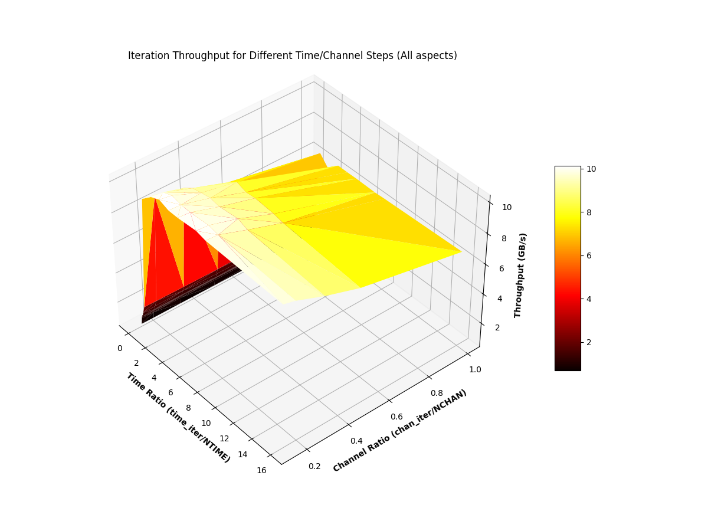

# GUPPI RAW C99 Library

This library support ingesting and creating GUPPI RAW files. Such files have one or more blocks, which are pairs of FITS formatted headers (80 character entries) followed by binary data. While each block has blockdata, and each file has one or more blocks, a "stem" has one or more files and refers to the whole dataset: each file within a stem is enumerated with a suffix.

```
 file           !________________________________stem_filepath.%04d.raw_______________________...
 block         	!HEADER!___________________________________1___________________________________!
 aspect        	       !_________________1_________________!_________________2_________________!
 channel       	       !_____1_____!_____2_____!_____3_____!_____1_____!_____2_____!_____3_____!
 time          	       !_1_!_2_!_3_!_1_!_2_!_3_!_1_!_2_!_3_!_1_!_2_!_3_!_1_!_2_!_3_!_1_!_2_!_3_!
 polarization  	       !1!2!1!2!1!2!1!2!1!2!1!2!1!2!1!2!1!2!1!2!1!2!1!2!1!2!1!2!1!2!1!2!1!2!1!2!
 complex samples
```

There is only one critical header-entry (`BLOCSIZE`), the ommission of which results in an error, while further header-entries specify the block's shape, but have default values:

Key 		 | Value | Default
---------|-|-
BLOCSIZE | The block's data byte-size. `integer` | **Critical Requirement**
OBSNCHAN | Total number of channel, across all aspects. `integer > 0` | 1
NANTS    | Number of antenna-aspects. `integer > 0` | 1
NPOL     | Number of polarizations. `integer > 0` | 1
NBITS    | Number of bits per complex-component. `integer > 0` | 4
DIRECTIO | Header and Data are DIRECTIO (512) aligned with padding, or not. `integer [0, 1]` | 0

**Key features are**:
- multi-aspect files (antenna or beams)
- iteration of the data in user-defined, dynamic `[n_aspect, n_chan, n_time]` chunks
- automatic O_DIRECT inference based on DIRECTIO key-value
- standardised calculation of various block's data-shape values
- header parsing in a single-pass
- user-callback for header entry parsing
- file boundary transparency

## Arbitrary Iteration

This library enables arbitrary iteration over the data in a GUPPI RAW stem via `ntime, nchan, naspect` parameters to the `guppiraw_iterate_read` function. These parameters define the dimensions of each access into the data held within a stem. The latter 2 parameters are obviously limited to factors of the number of aspect-channels and aspects in a block, respectively. The `ntime` parameter can be any number.

`long guppiraw_iterate_read(guppiraw_iterate_info_t* gr_iterate, const size_t ntime, const size_t nchan, const size_t naspect, void* buffer);`

The `*buffer` parameter is expected to be appropriately large, with the provided `guppiraw_iterate_bytesize` defining the calculation.

### Iterate Frequency First (Default)

If the `guppiraw_iterate_info_t.iterate_time_first_not_frequency_first == false`, iteration will exhaust the aspect-channels (`n_aspectchan`), then the aspects (`n_aspect`) and only then the time (`n_time`) dimension of the stem. Each iteration steps through the underlying data as defined by the `ntime, nchan, naspect` parameters:

```
for time = 0; time + ntime <= n_time; time += ntime
	for aspect = 0; aspect < n_aspect; aspect += naspect
		for channel = 0; channel < n_aspectchan; channel += nchan
			...
```

### Iterate Time First

Otherwise, if the `guppiraw_iterate_info_t.iterate_time_first_not_frequency_first == true`, iteration will exhaust the time (`n_time`), then the aspects (`n_aspect`) and only then the aspect-channels (`n_aspectchan`) dimension of the stem. Each iteration steps through the underlying data as defined by the `ntime, nchan, naspect` parameters:

```
for channel = 0; channel < n_aspectchan; channel += nchan
	for aspect = 0; aspect < n_aspect; aspect += naspect
			for time = 0; time + ntime <= n_time; time += ntime
			...
```


## Compilation

1. Use meson and ninja:

	`$ pip install meson ninja`

2. Configure the build directory:

	DIRECTIO support | Configuration command
	-|-
	No | `$ meson build -Dprefix=/usr/local`
	Yes | `$ meson build -Dprefix=/usr/local -Dc_args=-D_GNU_SOURCE`

3. Compile (and test) (and install)

	```
	       $ cd build
	build/ $ ninja && ninja test && ninja install
	```

## Benchmarks

Both the [`write`](./tests/write.c) and [`iterate`](./tests/iterate.c) test executables accept a `-V` option to instead benchmark writing and read-iterating through files, respectively.

The test rig is an `AMD EPYC 7352 24-Core Processor` machine, with 4 `TOSHIBA MQ01ABD1` NVMe drives in Raid0, `xfs` formatted.
It measured **roughly 8.7 GB/s when writing a 33 GB DIRECTIO stem, over 4 files**.

The read-iterate benchmark is more complicated, owing to the fact that iteration-datashapes are configurable. The benchmark, on the same 33 GB DIRECTIO stem, is captured in [text](./benchmarks/iterate.txt) and further plotted below.
- Iteration block-shapes with a time-dimension less than that of the blocks in the file have a drastically lower throughput.  
- Iteration block-shapes with a time-dimension greater than or equal to that of the blocks in the file have a stable throughput between **6 and 10 GB/s**, while lower aspect-channel ratios have higher throughput than those closer to `1.0`.




*There is also a [`key_comparison`](./tests/key_comparison.c) executable generated that measures the current key-comparison operation to be the fastest.*